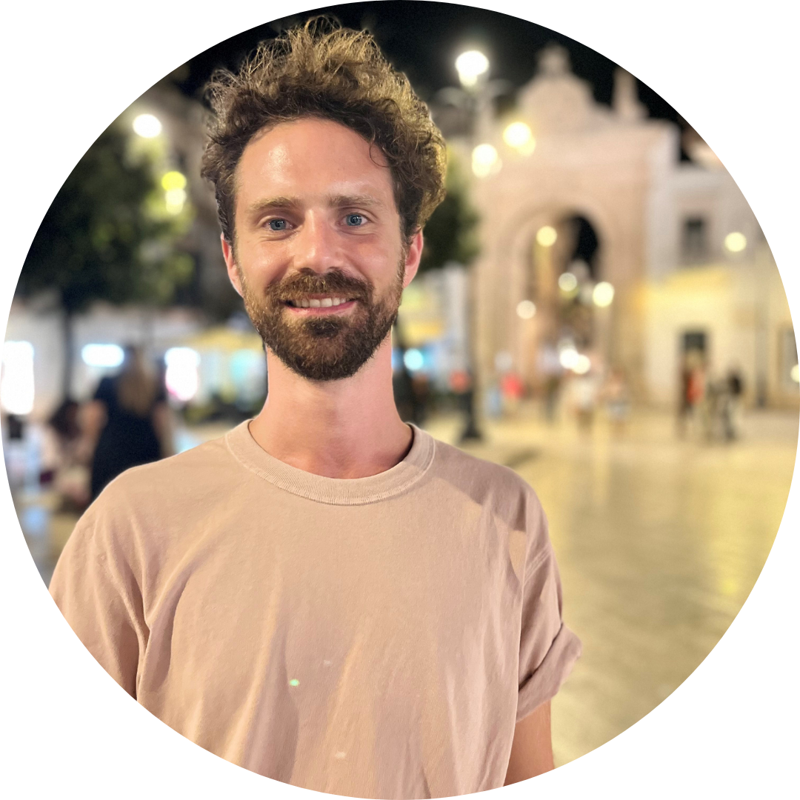

_Peanut butter and long books_ 🥜📚

Ciao, I am Gabriele Scrivanti and I am a postdoc researcher at [IPVF](https://www.ipvf.fr/en/)! 
Welcome to my webpage!

## About Me

I got my master's in mathematics at the University of Bologna in Italy, then did my PhD at Université Paris-Saclay, where I was part of the MSCA ITN ["Trade-OPT"](https://trade-opt-itn.eu/) 🧮

Now I'm at IPFV, still doing research and learning new things! 🔬 

## Research Interests

Currently, I am developing mathematical tools for the analysis of new photovoltaic materials ☀️ 

More broadly, I am intrested in solving complex problems at the intersection of **Mathematical Optimisation** 🔧, **Image Processing** 🖼️ and **Unsupervised Learning** 🤖

